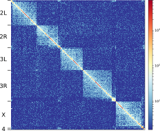
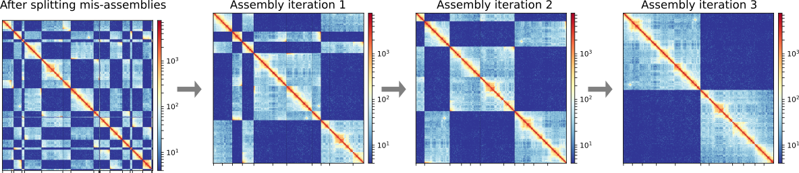
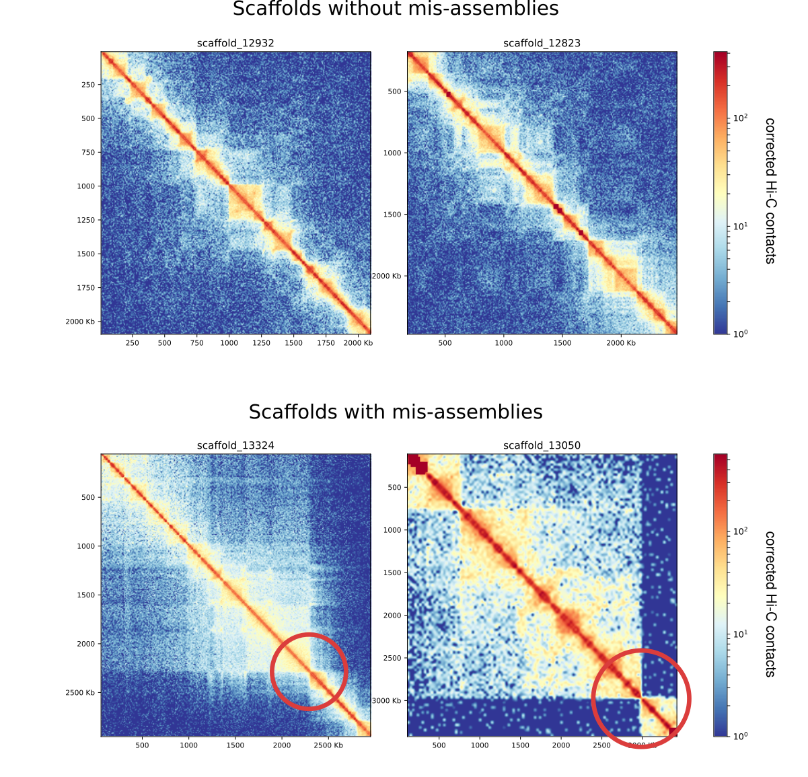
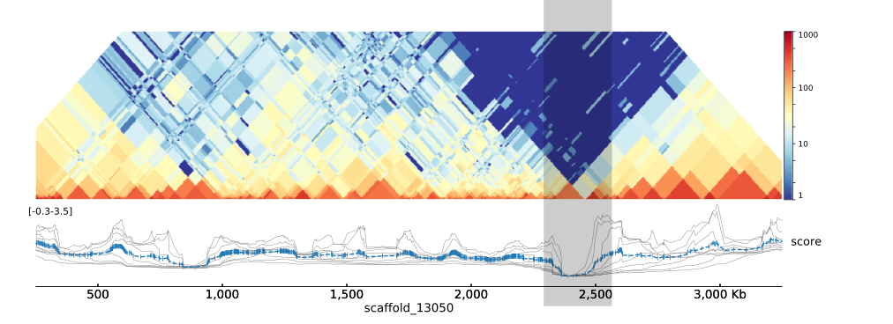

HiCAssembler
============

Hi-C scaffolding tool to assemble contigs/scaffolds into complete chromosomes
-----------------------------------------------------------------------------

This software uses Hi-C sequencing data to assemble contigs/scaffolds into
complete chromosomes. The assembly process consists of the following steps:

 * creation of corrected Hi-C contact matrix
 * detection of mis-assemblies (automatic and/or manual)
 * creation of initial path graph
 * iterative joining of high-confidence scaffold paths
 * addition of scaffolds that were not used yet
 * saving of scaffolds fasta file and liftover chain file

HiCAssembler automatically visualizes the assembly process to inform
the user on the assembly status




Installation
------------
HiCAssembler works with python 2.7 and can be installed with pip:

```bash
$ pip install HiCAssembler
```

If you want to install the latest version use:

```bash
$ pip install git+https://github.com/maxplanck-ie/HiCAssembler.git
```


Usage
-----
Before running HiCAssembler, creation of a corrected Hi-C matrix in h5 format
is required. This file format is the output created by HiCExporer (http://hicexplorer.readthedocs.io/en/latest/).
Hi-C reads need to be mapped to your pre-assembled contigs/scaffolds and then the
Hi-C matrix needs to be created and corrected. An example usage of HiCExporer for
these steps can be found at http://hicexplorer.readthedocs.io/en/latest/content/example_usage.html.

Afterwards, you can start to assemble your pre-assembled contigs/scaffolds
into chromosomes using HiCAssembler.

```bash
$ assemble -m Hi_C_matrix_corrected.h5 -o ./assembly_output \
--min_scaffold_length 100000 --bin_size 5000 --misassembly_zscore_threshold -1.0 \
--num_iterations 3 --num_processors 16
```

`--min_scaffold_length 100000` sets the minimal length of pre-assembled scaffolds
to 100 kb. Scaffolds smaller than 100 kb are added after the iterative correction.

`--bin_size 5000` sets the Hi-C bin size to 5 kb. This would be the size of
high-resolution bins referred to in the algorithm description.

`--misassembly_zscore_threshold -1.0` sets the threshold deciding if a
TAD-separation score is strong enough to be considered a mis-assembly.

`--num_iterations 3` sets the number of assembly iterations to 3.


In case your final result contains assembly errors, you can manually correct them.
The position of assembly errors can be specified and added as a position to
cut your pre-assembled contigs/scaffolds before the assembly using the
`--split_positions_file split.bed` parameter. The exact position of the error
in the pre-assembled contigs/scaffolds can be identified by using the tool
`plotScaffoldInteractive`.

```bash
$ plotScaffoldInteractive scaffold_123
```

The position of the assembly error is displayed by moving your cursor over it.

Citation
---------
If you use HiCAssembler in your analysis, you can cite the following paper :

#add paper #add doi and link [doi:](https://www...)

Examples
--------

(A small corrected Hi-C matrix can be found in the `data/` folder)

A minimal example of the assembly of several scaffolds:


```bash
$ assemble -m /data/hic_small.h5 -o ./assembly_output \
--min_scaffold_length 100000 --bin_size 5000 --misassembly_zscore_threshold -1.0 \
--num_iterations 3 --num_processors 16
```

Each step of the assembly is automatically visualized. 




Now, let's see how scaffolds with and without mis-assemblies look like:



Assembly errors can easily be detected as an abrupt change in the Hi-C signal.
HiCAssembler automatically splits scaffolds at minima of the Hi-C score as shown
here:



Strong TAD boundaries with a low TAD-separation score can wrongly be considered as
mis-assemblies. The threshold of the score where scaffolds get split needs to
be chosen using the `--misassembly_zscore_threshold` parameter.
A balance between too many splits and thus very small scaffolds after splitting
and too many left-over mis-assemblies needs to be found. We identified a score
of -1 as a good starting point for assemblies but we recommend to test several
settings. Some scaffolds will be split at TAD boundaries. This is no problem
because they will be connected again by the assembly process afterwards.

If not all mis-assemblies are split automatically, splits can be added manually
using the `--split_positions_file split.bed` parameter. The exact position of
the error in the pre-assembled contigs/scaffolds can be identified by using the tool
`plotScaffoldInteractive`.

```bash
$ plotScaffoldInteractive scaffold_123
```

The position of the assembly error is displayed by moving your cursor over it.
